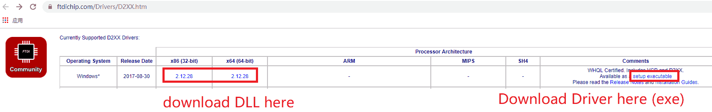
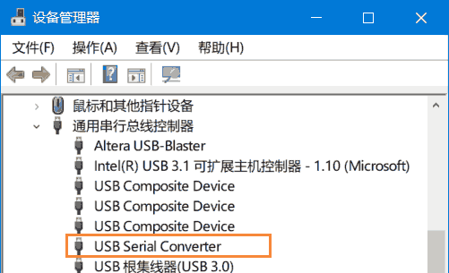

[English](#en) | [中文](#cn)

　

<span id="en">Install FTD2XX Driver and Python ftd2xx Library</span>
====================================

To run FT232H related Python programs on Windows, follow these steps:

> Note: This document was written in 2019. If the official website is updated later, the general process will definitely remain unchanged, but some operational details (for example, the download file cannot be found on the official website) will need to be worked around.

### Step1: Install FTD2XX Driver and download FTD2XX.dll

Go to [D2XX Driver website](https://www.ftdichip.com/Drivers/D2XX.htm), in the table in the D2XX Drivers column, download the  driver (.exe file) and install it. As shown below.

Also, to download the DLL, unzip it and find the FTD2XX.dll file that matches your computer. For a 32-bit computer, find the 32-bit(i386) DLL; for a 64-bit computer, find the 64-bit(amd64) DLL. If the file name is FTD2XX64.DLL, etc., please always rename it to FTD2XX.DLL



### Step2: Verify Installation

Insert the FT232H USB port of the development board into the computer. If the driver is installed successfully, a **USB Serial Converter** should be identified in the Windows Device Manager. As shown below.



### Step3: Install Python3

If you don't have Python3 installed, please go to [Anaconda website](https://www.anaconda.com/products/individual) to download and install Python3, the major version number must be Python3, not Python2.

Note: If it is a 32-bit computer, please install 32-bit Python; if it is a 64-bit computer, please install 64-bit Python.

### Step4: Install ftd2xx Library for Python

Open CMD or PowerShell, run command:

```powershell
python -m pip install ftd2xx
```

### Step5: Copy FTD2XX.dll File to Python Environment

Copy the FTD2XX.DLL file we downloaded in step1 to the Python's root directory (for example, on my computer, the Python root directory is **C:/Anaconda3/** ). Note that 32-bit Python must correspond to a 32-bit DLL; 64-bit Python must correspond to a 64-bit DLL.

Then, you can run the following statement in python to verify its installation:

```python
import ftd2xx
```


Now the Python runtime environment required by the FT232H is ready.


　

　

　

　

<span id="cn">安装 FTD2XX 驱动和 Python FTD2XX 库</span>
====================================

要在 Windows 上运行 FT232H 相关的 Python 程序，请进行以下步骤： 

> :warning: 该文档写于 2019 年，如果之后官网更新，大致流程肯定不变，但一些操作细节（例如官网上找不到下载文件了）就要变通变通了。

### 步骤1：安装 FTD2XX 驱动和 FTD2XX.DLL

进入 [D2XX Driver 官网页面](https://www.ftdichip.com/Drivers/D2XX.htm) ，在 D2XX Drivers 那一栏的表格里，下载exe形式的驱动并安装。如下图。

另外，要下载 DLL 压缩包， 解压后在里面找到符合你计算机的 FTD2XX.DLL 文件。若为32位计算机，请找到 32-bit(i386) DLL；若为64位计算机，请找到 64-bit (amd64) DLL。如果文件名是 FTD2XX64.DLL 等，请一律重命名为 FTD2XX.DLL


### 步骤2：验证驱动安装

将开发板的 FT232H USB 口插入电脑，如果驱动安装成功，则 Windows 设备管理器里应该识别出 **USB Serial Converter** 。如下图。


### 步骤3：安装 Python3

如果你没有安装 Python3， 请前往 [Anaconda官网](https://www.anaconda.com/products/individual) 下载安装 Python3 ，必须是 Python3 ，不能是 Python2 。

注：若为32位计算机，请安装32位的Python；若为64位计算机，请安装64位的Python。

### 步骤4：安装 python ftd2xx 库

打开 CMD 或 PowerShell ，运行命令：

```powershell
python -m pip install ftd2xx
```

### 步骤5：复制 FTD2XX.DLL 文件到 Python 环境中

复制 **步骤1** 中我们找到的 FTD2XX.DLL 文件到 Python 根目录（例如在我的电脑上， Python 根目录是 **C:/Anaconda3/** ）。注意32位的Python必须对应32位的DLL；64位的Python必须对应64位的DLL。

然后，可以在 python 中运行以下语句来验证安装：

```python
import ftd2xx
```


至此，FT232H 所需的 Python 运行环境已就绪。
