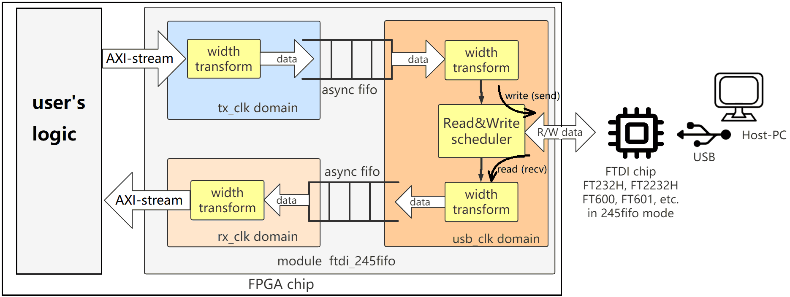
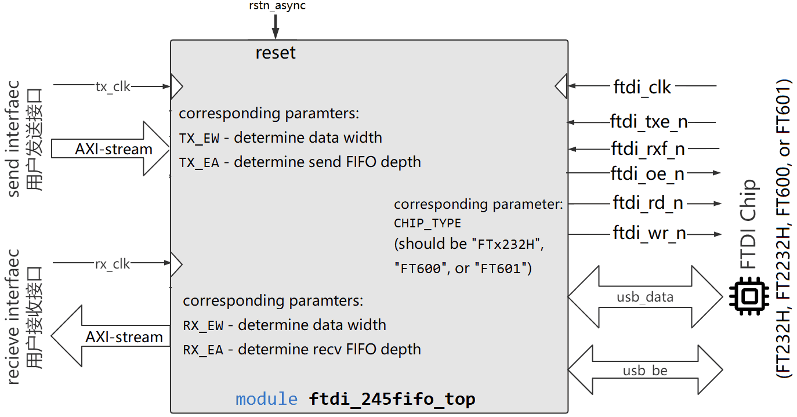
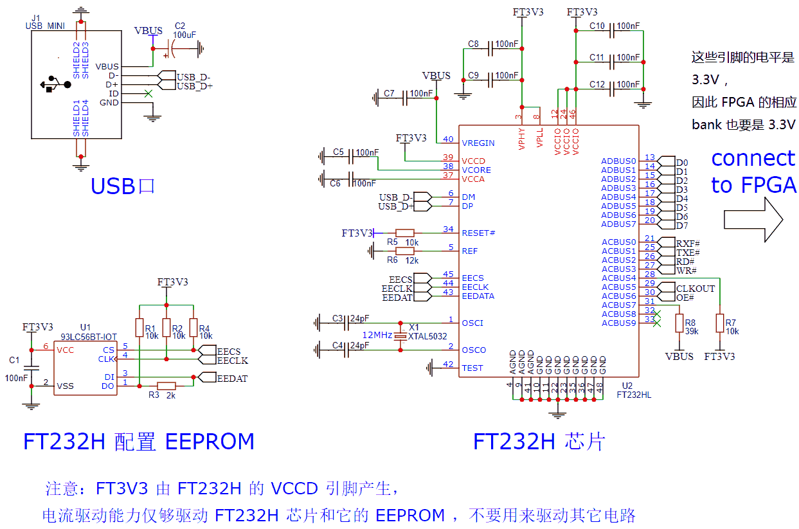
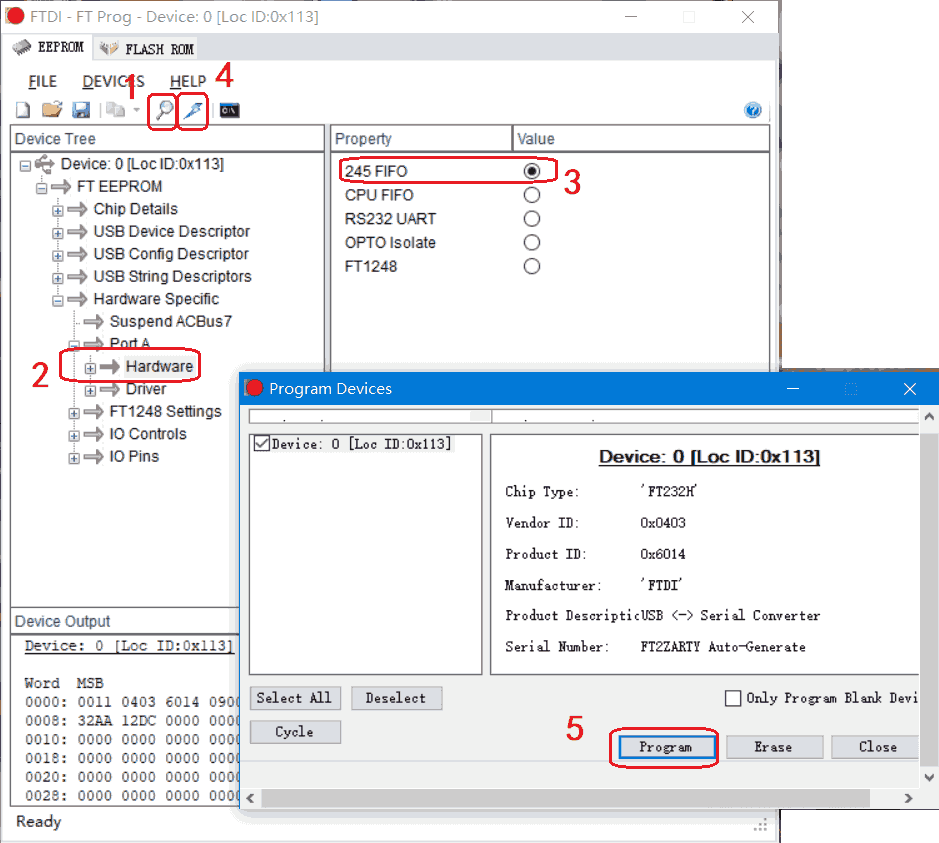
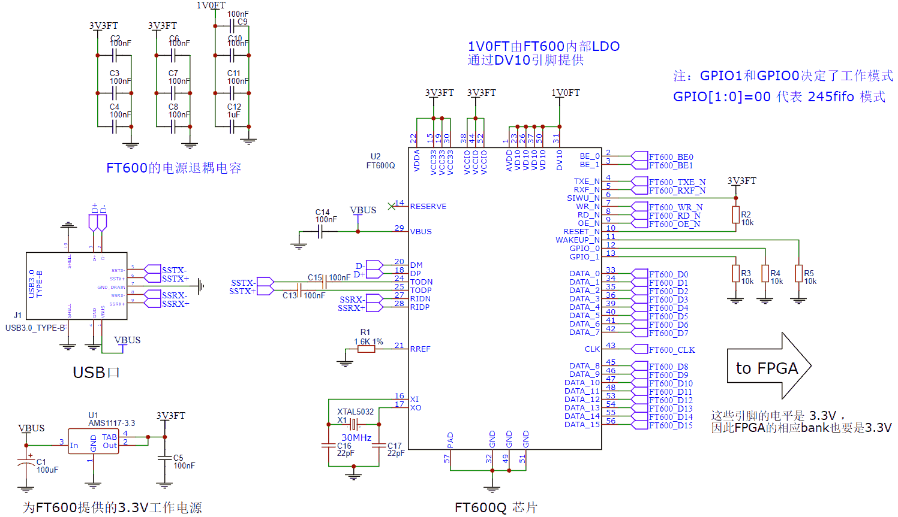

-9A90FD.svg)   

[English](#en) | [中文](#cn) 

　

<span id="en">FTDI 245fifo controller</span>
===========================

An FPGA-based controller for [FT232H](https://ftdichip.com/Products/ICs/FT232H.htm) , [FT2232H](https://ftdichip.com/Products/ICs/FT2232H.htm) , [FT600](https://ftdichip.com/Products/ICs/FT600.html) , [FT601](https://ftdichip.com/Products/ICs/FT600.html) chips in sync-245-fifo mode, which can realize fast USB communication between FPGA and Host-PC.

> Update on June 2023: Add support for byte enable signals. Now it supports all features of FTDI sync-245-fifo mode, and the length of the sending and receiving bytes no longer needs to be a multiple of FTDI chip's byte-width.

　

# Introduction

**sync-245-fifo mode** is the highest speed transmission mode of FTDI's USB series chips. This repository implement a sync-245-fifo mode controller Verilog IP core (**ftdi_245fifo_top**), providing AXI-stream send and receive interfaces for Verilog developers.

In addition, this repository provides supplementary:
* Simulation code to verify **ftdi_245fifo_top**
* FPGA sample code as a demo of using **ftdi_245fifo_top**

For Host-PC, I provide:

* FTDI driver installation tutorials,
* Python3 FTDI USB software library (ftd2xx and ftd3xx) installation tutorials,
* Several Python3 programs for testing.

> Note: Although the example code of Host-PC is written in Python (I used to use Python), you can also write program in other languages (C++, C #, etc.) to communicate with the FTDI chip. The design on FPGA is not limited to which programming language you use on Host-PC.

　

|  |
| :------------------------------------------: |
| **Figure1** : diagram of ftdi_245fifo_top.v  |

　

## IP's Technical Features

* Pure Verilog design, which is easy to transplant to FPGAs of Altera, Xilinx, or other manufacturers.
* Standard AXI-stream interface for sending and receiving.
* **Send/Receive scheduling**: The interface between FTDI USB chip and FPGA is half-duplex. This module schedules the sending and receiving using time-division multiplexing to achieve **independent sending and receiving**.
* **Clock Domain Crossing**: The FTDI USB chip has its own clock. This module uses asynchronous FIFO to realize clock domain crossing, so that the send and receive AXI-stream interface can use **custom clocks** .
* **Bit width conversion**: This module realizes the bit width conversion so that the **bit width of the AXI-stream can be customized** .

　

## Performance Test Results

|                             | FT232H / FT2232H |   FT600   |    FT601     |
| :-------------------------: | :--------------: | :-------: | :----------: |
|       USB generation        |    USB2.0 HS     | USB3.0 SS |  USB3.0 SS   |
|   Theoretical Throughput    |      60MB/s      |  200MB/s  |   400MBps    |
| Tested Throughput (FPGA→PC) |      42MB/s      |  140MB/s  | not test yet |
| Tested Throughput (PC→FPGA) |      35MB/s      |  175MB/s  | not test yet |

　

　

# ftdi_245fifo Module Manual

The top design code is in [ftdi_245fifo_top.v](./RTL/ftdi_245fifo/ftdi_245fifo_top.v) in [RTL/ftdi_245fifo](./RTL/ftdi_245fifo) folder, which can be called by FPGA developers to develop their own USB communication applications. Its interface and parameters are shown in **Figure2**.

|        |
| :----------------------------------------: |
| **Figure2** : interfaces of ftdi_245fifo.v |

　

## Module Parameters

To use this module, you should first determine the value of each Verilog parameter, as shown in the following table:

| parameter   | Introduction                                                 |
| ----------- | ------------------------------------------------------------ |
| `TX_EW`     | Determines the data width of the AXI-stream sending interface (that is, the width of `tx_data`): 0 corresponds to 8bit width, 1 corresponds to 16bit width, 2 corresponds to 32bit width, and so on. It can be set arbitrarily according to your requirement and is not limited by the FTDI USB chip you used. |
| `TX_EA`     | Determines the depth of send buffer, depth=2^TX_EA. The default is 10 (that is, the default depth is 1024). If the FPGA BRAM is larger, it can be set larger to improve burst performance. |
| `RX_EW`     | Determines the data width of the AXI-stream receiving interface (that is, the width of `rx_data`): 0 corresponds to 8bit width, 1 corresponds to 16bit width, 2 corresponds to 32bit width, and so on. It can be set arbitrarily according to your requirement and is not limited by the FTDI USB chip you used. |
| `RX_EA`     | Determines the depth of receive buffer, depth=2^RX_EA. The default is 10 (that is, the default depth is 1024). If the FPGA BRAM is larger, this item can be set larger to improve burst performance. |
| `CHIP_TYPE` | should be `"FTx232H"` , `"FT600"` , or `"FT601"` according to the FTDI chip you used |

　

## Module Interface: reset

The reset signal of ftdi_245fifo_top.v is:

```verilog
input  wire                    rstn_async;
```

`rstn_async` is the global asynchronous reset of the module, 0 means reset, 1 means release reset. This signal can be directly set to `1'b1`, or connected to the global reset signal.

　

## Module Interface: Connect to FTDI Chip

The FTDI chip's signals of ftdi_245fifo_top.v are:

```verilog
// Connect to FTDI chip ------------------------------
input  wire                    ftdi_clk;
input  wire                    ftdi_rxf_n;
input  wire                    ftdi_txe_n;
output wire                    ftdi_oe_n;
output wire                    ftdi_rd_n;
output wire                    ftdi_wr_n;
inout       [(8<<CHIP_EW)-1:0] ftdi_data;
inout       [(1<<CHIP_EW)-1:0] ftdi_be;
```

Note:

* When the FTDI USB chip works in sync-245-fifo mode, see the chip's datasheet for its pin definations:
  * for FT232H, see [FT232H DataSheet](https://www.ftdichip.com/Support/Documents/DataSheets/ICs/DS_FT232H.pdf) page 9;
  * for FT2232H, see [FT2232H DataSheet](https://www.ftdichip.com/Support/Documents/DataSheets/ICs/DS_FT2232H.pdf) page 9;
  * for FT600 or FT601, see [FT600/FT601 DataSheet](https://www.ftdichip.com/Support/Documents/DataSheets/ICs/DS_FT600Q-FT601Q%20IC%20Datasheet.pdf) page7-10.
* `ftdi_be` is the byte enable signal, only FT600 and FT601 chips have this signal. For FT232H and FT2232H, ignore it.
* The waveform of these pins is maintained by the module. You don't need to pay attention about it. If you are interested, you can run [RTL simulation](#Module Simulation).

　

## Module Interface: AXI-stream sending interface

The sending interface is a standard AXI-stream slave, which allows users to send data to FTDI chip (which will be sent to Host-PC). Corresponding definations:

```verilog
// AXI-stream slave sending interface ------------------------------
input  wire                    tx_clk;       // AXI-stream's clock
output wire                    tx_tready;
input  wire                    tx_tvalid;
input  wire   [(8<<TX_EW)-1:0] tx_tdata;
input  wire   [(1<<TX_EW)-1:0] tx_tkeep;
input  wire                    tx_tlast;
```

Firstly, you should provide a clock on `tx_clk` (no special limitations of frequency, usually the main clock of FPGA). The AXI-stream is synchronized with the clock.

The operation sequence of AXI-stream is detailed in [AXI-stream specification](https://documentation-service.arm.com/static/60d5b244677cf7536a55c23e) . Here is a brief explanation:

* When `tx_tready=1`, the module is ready to accept a data. When `tx_tready=0`, the send buffer is temporarily full and no more data can be accepted.
* When `tx_tvalid=1`, it means that the user wants to send a data to the send buffer. Meanwhile, `tx_tdata` , `tx_tkeep` and `tx_tlast` should produce a valid data.
* `tx_tvalid` and `tx_tready` are a pair of handshake signals. When both are 1, `tx_tdata` is successfully sended.

* As mentioned earlier, the parameter `TX_EW` determines the data bit width of the AXI-stream:
  * if `TX_EW=0` , then `tx_tdata` is 1-byte wide (8-bits), `tx_tkeep` is 1-bit wide;
  * if `TX_EW=1` , then `tx_tdata` is 2-byte wide (16-bits), `tx_tkeep` is 2-bit wide;
  * if `TX_EW=2` , then `tx_tdata` is 4-byte wide (32-bits), `tx_tkeep` is 4-bit wide;
  * if `TX_EW=3` , then `tx_tdata` is 8-byte wide (64-bits), `tx_tkeep` is 8-bit wide.
* `tx_tdata` is in LITTLE ENDIAN. When Host-PC receiving data, The low byte on `tx_tdata` is earlier, the high byte on `tx_tdata` is later.
* `tx_tkeep` is byte valid signal, which specifies which bytes in `tx_tdata` are valid (need to send) and which bytes are invalid (needn't to send)
* For example, when `tx_tdata` is 4-byte wide, `tx_tkeep` is 4-bit wide:
  * `tx_tkeep[0]=1` means `tx_tdata[7:0]` need to be sent. Otherwise it will not be sent
  * `tx_tkeep[1]=1` means `tx_tdata[15:8]` need to be sent. Otherwise it will not be sent
  * `tx_tkeep[2]=1` means `tx_tdata[23:16]` need to be sent. Otherwise it will not be sent
  * `tx_tkeep[3]=1` means `tx_tdata[31:24]` need to be sent. Otherwise it will not be sent

* The bits of `tx_tkeep` can be specified arbitrarily. For example, this strange value `tx_tkeep=4'b1010` is also supported.
* `tx_tlast` is the packet end signal of AXI-stream. It is used here to determine whether the current data should be sent immediately or wait for enough bit width to be saved before sending. For example, when the width of `tx_tdata` is 4 bytes, if the user only wants to send 1 byte (such as setting `tx_tkeep=4'b0001`). At this point, if `tx_tlast=0` , the byte will be temporarily stored in the module and will be sent after the subsequent data arrives to make up for 4 bytes. If user wants to send it immediately, they should set `tx_tlast=1` when sending `tx_tdata`
* If users don't want to make it so complicated, they can set `tx_tkeep`  to all 1 and set ` tx_tlast` to 1. In this case, although only data with a multiple length of (`2^TX_EW`) can be sent, it is simpler to use.

> :warning: FTDI chips can only send and receive pure data streams without the concept of data packets, so `tx_tlast` is only used to control whether to send immediately. After the data is sent to the computer, the software cannot know where is the boundary that  `tx_tlast`  specified.

　

## Module Interface: AXI-stream receiving interface

The receiving interface is a standard AXI-stream master, which allows users to receive data from FTDI chip (from Host-PC). Corresponding definations:

```verilog
// AXI-stream master receiving interface ------------------------------
input  wire                    rx_clk;       // AXI-stream clock
input  wire                    rx_tready;
output wire                    rx_tvalid;
output wire   [(8<<RX_EW)-1:0] rx_tdata;
output wire   [(1<<RX_EW)-1:0] rx_tkeep;
output wire                    rx_tlast;
```

Firstly, you should provide a clock on `rx_clk` (no special limitations of frequency, usually the main clock of FPGA). The AXI-stream is synchronized with the clock.

`rx_clk` can be as same as or different from `tx_clk` .

Note the following:

* When `rx_tready=1`, it means that the user is ready to fetch out a data.
* When `rx_tvalid=1`, it means that the module wants to send a data to the user. Meanwhile, a valid data appeared on `rx_tdata` ,`rx_tkeep` and `rx_tlast` . When `rx_tvalid=0`, the receive buffer is empty and no more data can be fetched out.
* `rx_tvalid` and `rx_tready` are a pair of handshake signals. When both are 1, `rx_tdata` is successfully fetched out from the receive buffer.
* As mentioned earlier, the parameter `RX_EW` determines the data bit width of the AXI-stream:
  * if `RX_EW=0` , then `rx_tdata` is 1-byte wide (8-bits), `rx_tkeep` is 1-bit wide;
  * if `RX_EW=1` , then `rx_tdata` is 2-byte wide (16-bits), `rx_tkeep` is 2-bit wide;
  * if `RX_EW=2` , then `rx_tdata` is 4-byte wide (32-bits), `rx_tkeep` is 4-bit wide;
  * if `RX_EW=3` , then `rx_tdata` is 8-byte wide (64-bits), `rx_tkeep` is 8-bit wide.
* `rx_tdata` is in LITTLE ENDIAN. When Host-PC sending data, The earlier byte is on the low byte of `rx_tdata` , the later byte is on the high byte of `rx_tdata` .
* `rx_tkeep` is the byte valid signal of AXI-stream, usually all 1. Only when Host-PC sends data with non integer multiple length of `(2^RX_EW)` bytes can it be not all 1.
* `rx_tlast` is AXI-stream packet last signal. `rx_tlast=1` indicates that there is no more data in the FTDI chip (all the data sent by the computer has been taken), and the current data is currently the last data.
* When `rx_tlast=1` , `rx_tkeep` may not be all 1. When `rx_tlast=0` , `rx_tkeep` must be all 1.
* For example, when `rx_tdata` is 4-byte wide, when meeting `tx_tlast=1` , then `rx_tkeep` may be:
  * `rx_tkeep=4'b0001` indicate that only `rx_tdata[7:0]` (1byte) is valid.
  * `rx_tkeep=4'b0011` indicate that only `rx_tdata[15:0]` (2bytes) is valid.
  * `rx_tkeep=4'b0111` indicate that only `rx_tdata[23:0]` (3bytes) is valid.
  * `rx_tkeep=4'b1111` indicate that all `rx_tdata[31:0]` (4bytes) is valid.
* `rx_tkeep` can only be above-mentioned patterns, and wil not be strange like `rx_tkeep=4'b1010` . In contrast, the `tx_tkeep` signal of the sending interface mentioned above supports these strange values.

> :warning: FTDI chips can only send and receive pure data streams without the concept of data packets, so `rx_tlast` is only used to indicate whether the current data is the last data taken out of the FTDI chip's buffer. The software on the Host-PC cannot control `rx_tlast` signal. For example, if you call `usb.send()` function twice in the software, the two blocks of data may be merged after being sent to the FPGA, and there may not be a `rx_tlast=1` boundary between them.

　

## Further explanation for tvalid&tready handshake

Take the following waveform as an example, in this waveform, the user interface sends 3 data: D1, D2, D3.

* In the 1st and 2nd cycles, the user sets `tx_tvalid=0` , so it is temporarily idle and no data is sent.

* In the 3rd cycle, the user wants to send D1, so it set `tx_tvalid=1`, this cycle `tx_tready=1`, indicating that D1 is sent to buffer successfully.

* In the 4th, 5th, 6th, and 7th cycles, the user wants to send D2, so it set `tx_tvalid=1` , but the 4th, 5th, 6th cycles `tx_ready=0` cause the transmission to temporarily fail until the 7th cycle `tx_tready=1 ` is sent successfully.

* In the 8th and 9th cycles, the user sets `tx_tvalid=0`, so it is temporarily idle and no data is sent.

* In the 10th cycle, the user wants to send D3, so it set `tx_tvalid=1`, this cycle `tx_tready=1`, indicating that D3 is sent successfully.

```
cycle                          1     2     3     4     5     6     7     8     9     10    11
                             _    __    __    __    __    __    __    __    __    __    __    __
 clk                          \__/  \__/  \__/  \__/  \__/  \__/  \__/  \__/  \__/  \__/  \__/  \
                                         _____________________________             _____
tx_tvalid                    ___________/                             \___________/     \________
                             _________________                   ________________________________
tx_tready                                     \_________________/
                                         _____ _______________________             _____
tx_tdata/tx_tkeep/tx_tlast   XXXXXXXXXXXX__D1_X___________D2__________XXXXXXXXXXXXX__D3_XXXXXXXXX
```

　

　

Simulation
=============================

Simulation related files are in the [SIM](./SIM) folder, where:

- tb_ftdi_chip_model.v simulates a simple behavior of FTDI chip.
- tb_ftdi_245fifo.v is the top module for simulation, which connect tb_ftdi_chip_model.v to ftdi_ft245fifo_top (design under test).
- tb_ftdi_245fifo_run_iverilog.bat is the command script to run the iverilog simulation (for Windows).

The behavior of this simulation is that the FTDI chip continuously sends increasing bytes to the FPGA. The FPGA connects the AXI-stream sending interface and receiving interface loopback. Therefore, the data will be sent back to the FTDI chip, and the FTDI chip will receive the increasing bytes.

## Use iverilog to simulate

Before using iverilog for simulation, you need to install iverilog , see: [iverilog_usage](https://github.com/WangXuan95/WangXuan95/blob/main/iverilog_usage/iverilog_usage.md)

Then double-click tb_ftdi_245fifo_run_iverilog.bat to run simulation (only for Windows), and then you can open the generated dump.vcd file to view the waveform.

## Use other simulators

You need to add all .v files in [SIM](./SIM) folder and [RTL/ftdi_245fifo](./RTL/ftdi_245fifo) folder into the simulation project. And set tb_ftdi_245fifo.v as the top. And then run simulation.

　

　

# Getting started with FT232H

FT232H is a USB2.0 High Speed communication chip with a theoretical rate of 60MBps. In this demo, the FPGA communicates with Host-PC through FT232H.

> :warning: This demo also applies to FT2232H (you need to work around it yourself), because FT2232H is highly similar to FT232H. Note that FT2232H's **channel-A** can be configured to **sync-245-fifo mode** , but **channel-B** cannot.
>

## Step1: Install FTD2XX Driver and Library

Please follow the instructions in [FTD2XX_guide.md](./FTD2XX_guide.md) to install the FTD2XX driver and Python FTD2XX library on your Host-PC (Windows system).

## Step2: Deploy FPGA Project

Following is the hierarchical structure of the FPGA project:

- **fpga_top_ft232h_loopback.v** (in [RTL/fpga_ft232h_example](./RTL/fpga_ft232h_example) ) , is the top of the whole project
  - **clock_beat.v** (in [RTL/fpga_ft232h_example](./RTL/fpga_ft232h_example) )
  - **ftdi_245fifo_top.v** (in [RTL/ftdi_245fifo](./RTL/ftdi_245fifo) ) , is the top of IP
    -  Other .v files in [RTL/ftdi_245fifo](./RTL/ftdi_245fifo) , they will be called by **ftdi_245fifo_top**

Please add above-mentioned files to FPGA project

Then, please make pin constraints in the FPGA project. Specifically, you need to check the schematic of your FPGA board (or the supporting materials of the development board) to understand which FT232H pin should connected to which FPGA pin; then, constraint the signals of the top layer of the FPGA project to the corresponding FPGA pin. The correspondence is shown in the following table (this table is simplified from [FT232H DataSheet](https://www.ftdichip.com/Support/Documents/DataSheets/ICs/DS_FT232H.pdf) page 9):

| FT232H pin | FT232H pin name | FT232H pin name (in 245-fifo mode) | signal name in top module |
| :--------: | :-------------: | :--------------------------------: | :-----------------------: |
|     13     |     ADBUS0      |                 D0                 |        ftdi_data[0]        |
|     14     |     ADBUS1      |                 D1                 |        ftdi_data[1]        |
|     15     |     ADBUS2      |                 D2                 |        ftdi_data[2]        |
|     16     |     ADBUS3      |                 D3                 |        ftdi_data[3]        |
|     17     |     ADBUS4      |                 D4                 |        ftdi_data[4]        |
|     18     |     ADBUS5      |                 D5                 |        ftdi_data[5]        |
|     19     |     ADBUS6      |                 D6                 |        ftdi_data[6]        |
|     20     |     ADBUS7      |                 D7                 |        ftdi_data[7]        |
|     21     |     ACBUS0      |               RXF\#                |          ftdi_rxf_n          |
|     25     |     ACBUS1      |               TXE\#                |          ftdi_txe_n          |
|     26     |     ACBUS2      |                RD\#                |          ftdi_rd_n          |
|     27     |     ACBUS3      |                WR\#                |          ftdi_wr_n          |
|     28     |     ACBUS4      |               SIWU\#               |  ftdi_siwu (=1) :warning:  |
|     29     |     ACBUS5      |               CLKOUT               |          ftdi_clk          |
|     30     |     ACBUS6      |                OE\#                |          ftdi_oe_n          |
|     31     |     ACBUS7      |              PWRSAV\#              | ftdi_pwrsav (=1) :warning: |
|     34     |     RESET\#     |              RESET\#               | ftdi_resetn (=1) :warning: |

> :warning: SIWU\#, PWRSAV\# and RESET\# in the above table are actually always pulled to high. Some boards directly use resistors to pull-up them without connecting them to the FPGA, in this case, you don't need to constrain these pins and simply comment out the statements related to them in fpga_top_example_ft232h.v.

　

If you want to design the FT232H PCB by yourself, please refer to **Figure3**.

|       |
| :----------------------------------------------------------: |
| **Figure3** : Example schematic of FT232H USB interface circuit. |

　

Notations of the clock and timing constraints:

- There are two clocks in this project: the main clock (clk) and the clock from the FT232H chip (ftdi_clk).
- For FT232H, ftdi_clk frequency is 60MHz.
- There's no special limitations on the frequency of clk. which can be from a few MHz to a few hundred MHz. The simplest way is to directly use the oscillator of FPGA board.
- `constraint_ft232h.sdc` shows an example of timing constraints, which constrain:
  - Frequency of ftdi_clk (60MHz)
  - Frequency of clk (you need to constrain it to the actual frequency)
  - Specify that ftdi_clk and clk are asynchronous.

- `constraint_ft232h.sdc`  is directly applicable to Altera Quartus projects. For Xilinx's xdc, the constraint statements should be similar (there may be some slight differences, please modify them yourself)

- If you are lazy to make timing constraints, you can also leave them unconstrained, it is probably no problem.

　

Other Notations:

- LED[3:0] connects 4 LEDs (not necessary) , where:
  - if ftdi_clk runs, LED[3] will blink. Usually ftdi_clk will start to run when first time of communication rather than when power on.
  - LED[2:0] shows the low 3 bits of the last-received data.
- parameter `CHIP_TYPE` of ftdi_245fifo_top is set to "FTx232H", because we are using FT232H / FT2232H chip.

　

## Step3: Program FT232H chip

For each FT232H chip, it needs to be programmed to 245-fifo mode when it is used for the first time. Each FT232H chip only needs to be programmed once, because there is an EEPROM chip on the periphery of the FT232H to permanently save the configuration, and it does not need to be programmed again every time it is used (unless you program it to another mode).

First go to the [FTDI download page](https://ftdichip.com/utilities/#ft_prog) to download and install **FT\_Prog** software. Then do the following steps:

* Plug the USB of FT232H to the computer, and unplug all other FTDI USB chip or device (including FPGA downloaders, because some FPGA downloaders, such as Xilinx Digilent downloaders, are implemented using FT2232H chip, if the program inside the downloader is overwritten, your downloader will be broken).
* Open **FT\_Prog** software.
* As shown in **Figure4**, click **Scan and Parse** (the small magnifying glass) to scan all FTDI chips plugged into the computer and find the corresponding chip of FT232H.
* In the property tree below FT232H, expand level by level, find and click "Hardware" .
* Select 245 FIFO mode on the right.
* Click **Program** (the small lightning) in the upper toolbar.
* A confirmation window pops up, click Program. Program to FT232H.
* After programming, you need to re-plug the USB to let this configuration takes effect.

|      |
| :-------------------------------------------------: |
| **Figure4** : Program FT232H chip to 245-fifo mode. |

　

## Step4: Run Programs on Host-PC

Before running these programs, make sure that FT232H has been programmed into 245-fifo mode according to step3, and the FPGA project created in step2 has been programed to FPGA.

I provide the following Python programs in [python](./python) folder that will communicate with FPGA through FT232H. 

| File Name               | Function                                                     |
| ----------------------- | ------------------------------------------------------------ |
| USB_FTX232H_FT60X.py    | Defines the USB_FTX232H_FT60X_sync245mode class, implements constructor, close, send, recv methods. This class is universal for FT232H, FT2232H, FT600, and FT601. |
| usb_loopback_simple.py | The Host-PC firstly sends 16 bytes to FPGA and then receives data. Because the FPGA project loopbacks data, the Host-PC will receive these 16 bytes. This program is associated with the FPGA top design fpga_top_ft232h_loopback.v |
| usb_loopback_mass.py | The Host-PC firstly sends a large amount of data to FPGA, and then receives data. Because the FPGA project loopbacks data, the Host-PC will receive these bytes and the program will compare whether the received data is consistent with the previously sent data to verify the correctness of the loopback. This program is associated with the FPGA top design fpga_top_ft232h_loopback.v |

　

　

# Getting Started with FT600

The FT600 is a USB3.0 Super Speed communication chip with a theoretical rate of 200MBps. In this example, the FPGA communicates with the Host-PC through FT600.

## Step1: Install FTD3XX Driver and Library

Please follow the instructions in [FTD3XX_guide.md](./FTD3XX_guide.md) to install the FTD3XX driver and Python FTD3XX library on your Host-PC (Windows system).

## Step2: Deploy FPGA Project

Following is the hierarchical structure of the FPGA project:

- **fpga_top_ft600_loopback.v** (in [RTL/fpga_ft600_example](./RTL/fpga_ft600_example) ) , is the top of the whole project
  - **clock_beat.v** (in [RTL/fpga_ft600_example](./RTL/fpga_ft600_example) )
  - **ftdi_245fifo_top.v** (in [RTL/ftdi_245fifo](./RTL/ftdi_245fifo) ) , is the top of IP
    -  Other .v files in [RTL/ftdi_245fifo](./RTL/ftdi_245fifo) , they will be called by **ftdi_245fifo_top**

Please add above-mentioned files to FPGA project.

Then, please make pin constraints in the FPGA project. Specifically, you need to check the schematic of your FPGA board (or the supporting materials of the development board) to understand which FT600 pin should connected to which FPGA pin; then, constraint the signals of the top layer of the FPGA project (that is, fpga_top_example_ft600.v) to the corresponding FPGA pin. The correspondence is shown in the following table (this table is simplified from [FT600 DataSheet](https://www.ftdichip.com/Support/Documents/DataSheets/ICs/DS_FT600Q-FT601Q%20IC%20Datasheet.pdf) page 7-10):

| FT600 pin number | FT600 pin name |         signal name in top module          |
| :--------------: | :------------: | :----------------------------------------: |
|        33        |     DATA_0     |                ftdi_data[0]                 |
|        34        |     DATA_1     |                ftdi_data[1]                 |
|        35        |     DATA_2     |                ftdi_data[2]                 |
|        36        |     DATA_3     |                ftdi_data[3]                 |
|        39        |     DATA_4     |                ftdi_data[4]                 |
|        40        |     DATA_5     |                ftdi_data[5]                 |
|        41        |     DATA_6     |                ftdi_data[6]                 |
|        42        |     DATA_7     |                ftdi_data[7]                 |
|        45        |     DATA_8     |                ftdi_data[8]                 |
|        46        |     DATA_9     |                ftdi_data[9]                 |
|        47        |    DATA_10     |                ftdi_data[10]                |
|        48        |    DATA_11     |                ftdi_data[11]                |
|        53        |    DATA_12     |                ftdi_data[12]                |
|        54        |    DATA_13     |                ftdi_data[13]                |
|        55        |    DATA_14     |                ftdi_data[14]                |
|        56        |    DATA_15     |                ftdi_data[15]                |
|        2         |      BE_0      |                 ftdi_be[0]                  |
|        3         |      BE_1      |                 ftdi_be[1]                  |
|        43        |     CLKOUT     |                  ftdi_clk                   |
|        5         |     RXF_N      |                  ftdi_rxf                   |
|        4         |     TXE_N      |                  ftdi_txe                   |
|        9         |      OE_N      |                   ftdi_oe                   |
|        8         |      RD_N      |                   ftdi_rd                   |
|        7         |      WR_N      |                   ftdi_wr                   |
|        6         |     SIWU_N     |          ftdi_siwu (=1) :warning:           |
|        10        |    RESET_N     |         ftdi_resetn (=1) :warning:          |
|        11        |    WAKEUP_N    | ftdi_wakeupn (=0) :triangular_flag_on_post: |
|        12        |     GPIO0      |  ftdi_gpio0 (=0) :triangular_flag_on_post:  |
|        13        |     GPIO1      |  ftdi_gpio1 (=0) :triangular_flag_on_post:  |

> :warning: SIWU\_N and RESET\_N in the above table are actually always pulled to high. Some boards directly use resistors to pull-up them without connecting them to the FPGA, in this case, you don't need to constrain these pins and simply comment out the statements related to them in fpga_top_example_ft600.v.
>
> :triangular_flag_on_post: WAKEUP\_N, GPIO0 and GPIO1 in the above table are actually always pulled to GND. Some boards directly use resistors to pull-down them without connecting them to the FPGA, in this case, you don't need to constrain these pins and simply comment out the statements related to them in fpga_top_example_ft600.v.

If you want to draw FT600 PCB by yourself, please refer to **Figure5**.

|         |
| :----------------------------------------------------------: |
| **Figure3** : Example schematic of FT600 USB interface circuit. |

　

Notations of the clock and timing constraints:

- There are two clocks in this project: the main clock (clk) and the clock from the FT600 chip (ftdi_clk).
- For FT600, ftdi_clk frequency is 100MHz.
- There's no special limitations on the frequency of clk. which can be from a few MHz to a few hundred MHz. The simplest way is to directly use the oscillator of FPGA board.
- `constraint_ft600.sdc` shows an example of timing constraints, which constrain:
  - Frequency of ftdi_clk (100MHz)
  - Frequency of clk (you need to constrain it to the actual frequency)
  - Specify that ftdi_clk and clk are asynchronous.

- `constraint_ft600.sdc`  is directly applicable to Altera Quartus projects. For Xilinx's xdc, the constraint statements should be similar (there may be some slight differences, please modify them yourself)

- If you are lazy to make timing constraints, you can also leave them unconstrained, it is probably no problem.

　

Other Notations:

- LED[3:0] connects 4 LEDs (not necessary) , where:
  - if ftdi_clk runs, LED[3] will blink. Usually ftdi_clk will start to run when first time of communication rather than when power on.
  - LED[2:0] shows the low 3 bits of the last-received data.
- parameter `CHIP_TYPE` of ftdi_245fifo_top is set to "FT600", because we are using FT600 chip.

　

## Step3: Run Programs on Host-PC

Before running these programs, make sure that the FPGA project created in step2 has been programed to FPGA.

I provide the following Python programs in [python](./python) folder that will communicate with FPGA through FT600. 

| File Name              | Function                                                     |
| ---------------------- | ------------------------------------------------------------ |
| USB_FTX232H_FT60X.py   | Defines the USB_FTX232H_FT60X_sync245mode class, implements constructor, close, send, recv methods. This class is universal for FT232H, FT2232H, FT600, and FT601. |
| usb_loopback_simple.py | The Host-PC firstly sends 16 bytes to FPGA and then receives data. Because the FPGA project loopbacks data, the Host-PC will receive these 16 bytes. This program is associated with the FPGA top design fpga_top_ft600_loopback.v |
| usb_loopback_mass.py   | The Host-PC firstly sends a large amount of data to FPGA, and then receives data. Because the FPGA project loopbacks data, the Host-PC will receive these bytes and the program will compare whether the received data is consistent with the previously sent data to verify the correctness of the loopback. This program is associated with the FPGA top design fpga_top_ft600_loopback.v |

　

# Reference

* FT232H chip：http://www.ftdichip.cn/Products/ICs/FT232H.htm
* FT232H software example：http://www.ftdichip.cn/Support/SoftwareExamples/CodeExamples.htm
* FT600 chip：http://www.ftdichip.cn/Products/ICs/FT600.html
* FT600/FT601 software example： http://www.ftdichip.cn/Support/SoftwareExamples/FT60X.htm


　

　

　

　


<span id="cn">FTDI 245fifo controller</span>
===========================

[FT232H](https://ftdichip.com/Products/ICs/FT232H.htm)、[FT2232H](https://ftdichip.com/Products/ICs/FT2232H.htm)、[FT600](https://ftdichip.com/Products/ICs/FT600.html) 、 [FT601](https://ftdichip.com/Products/ICs/FT600.html)  等芯片在 sync-245-fifo 模式下的控制器，实现 FPGA 与上位机 (电脑) 的高速通信。

> 2023/6 更新内容：加入 byte enable 信号的支持。现在已支持 FTDI sync-245-fifo 模式的所有功能，收发字节长度不再必须是 FTDI 芯片位宽的倍数。

　

# 简介

**sync-245-fifo 模式** 是 FTDI 公司的 USB 系列芯片的最高速的传输模式。本库将 sync-245-fifo 控制器封装成 Verilog 模块 (IP顶层模块名为 **ftdi_245fifo_top** )，它具有标准 AXI-stream 收发接口 ，供 Verilog 开发者调用。

除了 IP 核本身，本库还提供配套的：

* 仿真代码 (Verilog)
* IP 核调用示例 (Verilog)，实现了一些简单的通信业务逻辑：回环、发送指定长度数据包等。供开发者直接上板测试。

对于电脑 (上位机) ，我提供了：
* 驱动安装教程
* Python3 FTDI USB 软件库 (ftd2xx 和 ftd3xx) 的安装教程
* 几个 Python3 程序用于进行 USB 通信测试


> 注：虽然上位机的示例代码是用 Python 编写的 (我习惯用 Python) ，但你也可以用其它语言 (C++, C# 等) 编写上位机程序与 FTDI 芯片通信。FPGA 上的设计**并不局限你在上位机上使用哪种编程语言**。

　

**图1**是该系统工作时的结构框图。

|  |
| :------------------------------------------: |
|              **图1**：系统框图               |

　

## 特点

* **纯 Verilog 编写**，方便仿真，支持 Altera, Xilinx 等各厂商的 FPGA 。
* **标准 AXI-stream 接口**：用户通过两路 AXI-stream 收发数据 (一路发，一路收)。
* **收发调度**：FTDI USB 芯片与 FPGA 之间的接口是半双工的，该模块调度收发分时复用，在用户看来，收发的 AXI-stream 是独立的。
* **跨时钟域**：FTDI USB 芯片有自己的时钟 (ftdi_clk)，该时钟并不一直运行，不能作为 FPGA 的主时钟。该模块实现了时钟域转换。
* **位宽变换**：本模块实现了位宽变换。使得 AXI-stream 接口的 **位宽可自定义** 。

　

## 性能测试结果

| 芯片型号    | FT232H / FT2232H |  FT600     | FT601      |
| :--------: | :------------:     |   :------:    | :--------: |
| USB模式 | USB2.0 HS          |  USB3.0 SS     | USB3.0 SS  |
| 理论速率 | 60MB/s            |  200MB/s     | 400MB/s |
| 实测速率 (FPGA→上位机) | 42MB/s          |  140MB/s     | 未测 |
| 实测速率 (上位机→FPGA) | 35MB/s | 175MB/s | 未测 |

　

　

# ftdi_245fifo_top 模块说明

Verilog 设计代码见 [RTL/ftdi_245fifo](./RTL/ftdi_245fifo) 目录中的 [ftdi_245fifo_top.v](./RTL/ftdi_245fifo/ftdi_245fifo_top.v) ，它是IP的顶层，可供 FPGA 开发者调用来开发自己的 USB 通信业务。它的接口和参数如**图2**。

|  |
| :----------------------------------: |
|   **图2**：ftdi_245fifo_top.v 的接口   |

　

## 模块参数

要调用本模块，首先要根据实际情况指定各个参数 (parameter) 的值，如下表：

| parameter   | 说明                                                         |
| ----------- | ------------------------------------------------------------ |
| `TX_EW`     | 决定了用户发送接口的数据宽度 (即 `tx_tdata` 的宽度) : 0对应8bit宽，1对应16bit宽，2对应32bit宽，3对应64bit宽，…… 可以根据需要任意设置，不受 USB 芯片型号限制。 |
| `TX_EA`     | 决定了用户发送缓存的深度，深度=2^`TX_EA`。默认为10 (深度为1024) ，如果 FPGA BRAM 较大，该项可以设得更大，来提高突发性能。 |
| `RX_EW`     | 决定了用户接收接口的数据宽度 (即 `rx_tdata` 的宽度) : 0对应8bit宽，1对应16bit宽，2对应32bit宽，3对应64bit宽，…… 可以根据需要任意设置，不受 USB 芯片型号限制。 |
| `RX_EA`     | 决定了用户接收缓存的深度，深度=2^RX_AEXP。默认为10（即默认深度为1024），如果 FPGA BRAM 较大，该项可以设得更大，来提高突发性能。 |
| `CHIP_TYPE` | 必须是 `"FTx232H"` , `"FT600"` , 或 `"FT601"`                |

　

## 模块接口：复位

复位信号见 ftdi_245fifo_top.v 代码中的：

```verilog
input  wire                    rstn_async;
```

`rstn_async` 是模块的全局异步复位信号，`1'b0` 代表复位，`1'b1` 代表释放复位。在使用中，该信号可以直接设为 `1'b1` ，或者连接到工程的复位信号上。

　

## 模块接口：连接 FTDI 芯片

FTDI 芯片信号见 ftdi_245fifo_top.v 代码中的：

```verilog
// 连接 FTDI 芯片的信号 ------------------------------
input  wire                    ftdi_clk;
input  wire                    ftdi_rxf_n;
input  wire                    ftdi_txe_n;
output wire                    ftdi_oe_n;
output wire                    ftdi_rd_n;
output wire                    ftdi_wr_n;
inout       [(8<<CHIP_EW)-1:0] ftdi_data;
inout       [(1<<CHIP_EW)-1:0] ftdi_be;
```

这些信号应连接到 FTDI 芯片的引脚上。

* FTDI 芯片工作在 sync-245-fifo 模式时，引脚名称见芯片 Datasheet
  * 对于 FT232H ，见 [FT232H DataSheet](https://www.ftdichip.com/Support/Documents/DataSheets/ICs/DS_FT232H.pdf) 第9页；
  * 对于 FT2232H ，见 [FT2232H DataSheet](https://www.ftdichip.com/Support/Documents/DataSheets/ICs/DS_FT2232H.pdf) 第9页；
  * 对于 FT600 和 FT601 ，见 [FT600/FT601 DataSheet](https://www.ftdichip.com/Support/Documents/DataSheets/ICs/DS_FT600Q-FT601Q%20IC%20Datasheet.pdf) 第 7\~10 页。

* `ftdi_be` 是 byte enable 信号。FT232H / FT2232H 没有这个信号，此时请忽略它。
* 这些引脚的时序由模块维护，不需要你关注。如果你感兴趣，可以运行[模块仿真](#模块仿真) 。

　

## 模块接口：AXI-stream slave 发送接口

发送接口是标准 AXI-stream slave ，用户通过它发送数据给 FTDI 芯片 (最终会发送给电脑) 。对应代码中的：

```verilog
// AXI-stream slave 发送接口 ------------------------------
input  wire                    tx_clk;       // AXI-stream 时钟
output wire                    tx_tready;
input  wire                    tx_tvalid;
input  wire   [(8<<TX_EW)-1:0] tx_tdata;
input  wire   [(1<<TX_EW)-1:0] tx_tkeep;
input  wire                    tx_tlast;
```

首先，需要提供一个 `tx_clk` 时钟 (频率不限，一般都提供 FPGA 主时钟) 。该 AXI-stream 同步于该时钟。

AXI-stream 的操作时序详见 [《AXI-stream specification》](https://documentation-service.arm.com/static/60d5b244677cf7536a55c23e) 。这里简要说明如下：

* `tx_tready=1` 时，说明模块已经准备好接收发送数据。`tx_ready=0` 时，发送缓存暂时满，不能接收更多数据。
* `tx_tvalid=1` 时，说明用户想发送一个数据到模块内部的发送缓存。同时，`tx_tdata` 应产生有效数据。
* `tx_tvalid` 与 `tx_tready` 是一对握手信号。二者同时为 1 时， `tx_tdata` 成功发送。
* 上文已经提到，参数 `TX_EW` 决定了该 AXI-stream 的数据位宽：
  * `TX_EW=0` 时，`tx_tdata` 宽度为 1 字节 (8-bit) ，`tx_tkeep` 宽度为 1-bit ；
  * `TX_EW=1` 时，`tx_tdata` 宽度为 2 字节 (16-bit) ，`tx_tkeep` 宽度为 2-bit ；
  * `TX_EW=2` 时，`tx_tdata` 宽度为 4 字节 (32-bit) ，`tx_tkeep` 宽度为 4-bit ；
  * `TX_EW=3` 时，`tx_tdata` 宽度为 8 字节 (64-bit) ，`tx_tkeep` 宽度为 8-bit 。
* `tx_tdata` 是小端序。也即电脑收到字节流时， `tx_tdata` 的低位字节靠前，高位字节靠后。
* `tx_tkeep` 是 AXI-stream 的有效信号，用来指定 `tx_tdata` 的哪些字节有效 (需要发送) ，哪些字节无效 (不需要发送) 。
* 例如，当 `tx_tdata` 的位宽为 4 字节时，`tx_tkeep` 为 4-bit 宽：
  * `tx_tkeep[0]=1` 说明 `tx_tdata[7:0]` 需要发送，否则忽略不发送。
  * `tx_tkeep[1]=1` 说明 `tx_tdata[15:8]` 需要发送，否则忽略不发送。
  * `tx_tkeep[2]=1` 说明 `tx_tdata[23:16]` 需要发送，否则忽略不发送。
  * `tx_tkeep[3]=1` 说明 `tx_tdata[31:24]` 需要发送，否则忽略不发送。
* `tx_tkeep` 的各个 bit 可以任意指定，例如 `tx_tkeep=4'b1010` 这种奇怪的取值也是支持的。
* `tx_tlast` 是 AXI-stream 的包结尾信号。在这里用来决定当前数据是立刻发送，还是等待攒够了位宽再发送。例如，当 `tx_tdata` 的位宽为 4 字节时，如果用户每次只想发送 1 字节 (例如令 `tx_tkeep=4'b0001` )。此时如果 `tx_tlast=0` ，则该字节会暂时存在模块里，等待后续数据到来凑够 4 字节后再发送，而不会立刻发送。如果用户需要立刻发送，应该在数据有效时让 `tx_tlast=1` 。
* 如果用户不想搞的这么复杂，可以让 `tx_tkeep`=全1 , `tx_last`=1 ，此时每次只能发送 `tx_tdata` 位宽个字节，每次发送的数据都立刻发送，例如若 `tx_tdata` 的位宽为 4 字节，则无法实现 4 的非整数倍字节的数据发送，但用起来也更简单。

> :warning: FTDI 芯片只能收发单纯的数据流，而没有数据包的概念，因此 `tx_tlast` 仅仅用于控制是否立即发送。数据发到电脑上后，上位机的软件无法知道哪里是 `tx_last` 指定的包的分界点。

　

## 模块接口：AXI-stream master 接收接口

接收接口是标准 AXI-stream master ，用户通过它接收来自 FTDI 芯片 (来自电脑) 的数据。对应代码中的：

```verilog
// AXI-stream master 接收接口 ------------------------------
input  wire                    rx_clk;       // AXI-stream 时钟
input  wire                    rx_tready;
output wire                    rx_tvalid;
output wire   [(8<<RX_EW)-1:0] rx_tdata;
output wire   [(1<<RX_EW)-1:0] rx_tkeep;
output wire                    rx_tlast;
```

首先，需要提供一个 `rx_clk` 时钟 (频率不限，一般都提供 FPGA 主时钟) 。该 AXI-stream 同步于该时钟。

 `rx_clk` 可以和 `tx_clk` 是同一个时钟或不同时钟。

对 AXI-stream 各信号简要说明如下：

* `rx_tready=1` 时，说明用户已经准备好拿出一个数据。
* `rx_tvalid=1` 时，说明模块想发送一个数据给用户。同时，`rx_tdata` 上出现有效数据。而 `rx_tvalid=0` 时，接收缓存空，拿不出更多数据。
* `rx_tvalid` 与 `rx_tready` 是一对握手信号。二者同时为 1 时， `rx_tdata` 才成功从接收缓存中取出。
* 上文已经提到，参数 `RX_EW` 决定了该 AXI-stream 的数据位宽：
  * `RX_EW=0` 时，`rx_tdata` 宽度为 1 字节 (8-bit) ，`rx_tkeep` 宽度为 1-bit ；
  * `RX_EW=1` 时，`rx_tdata` 宽度为 2 字节 (16-bit) ，`rx_tkeep` 宽度为 2-bit ；
  * `RX_EW=2` 时，`rx_tdata` 宽度为 4 字节 (32-bit) ，`rx_tkeep` 宽度为 4-bit ；
  * `RX_EW=3` 时，`rx_tdata` 宽度为 8 字节 (64-bit) ，`rx_tkeep` 宽度为 8-bit 。
* `rx_tdata` 是小端序。也即 `rx_tdata` 的低位字节靠前，高位字节靠后。
* `rx_tkeep` 是 AXI-stream 的字节有效信号，一般都是全1。只有当电脑发送了非整数位宽的数据时，才可能是非全1 。
* `rx_tlast` 是 AXI-stream 的包结尾信号。在这里， `tlast=1` 说明 FTDI 芯片里已经没有更多的数据了 (电脑发送的所有数据已经暂时被拿完了) ，当前数据暂时是最后一拍数据了。
* 当 `rx_tlast=1` 时，`rx_tkeep` 可能不是全1 。当 `rx_tlast=0` 时，`rx_tkeep` 一定是全1。
* 例如当 `rx_tdata` 的位宽为 4 字节时，若遇到 `rx_tlast=1` ，则 `rx_tkeep` 可能有以下取值：
  * `rx_tkeep=4'b0001` 意为只有 `rx_tdata[7:0]` 这1字节有效；
  * `rx_tkeep=4'b0011` 意为只有 `rx_tdata[15:0]` 这2字节有效；
  * `rx_tkeep=4'b0111` 意为只有 `rx_tdata[23:0]` 这3字节有效；
  * `rx_tkeep=4'b1111` (全1) 意为 `rx_tdata[31:0]` 这4字节都有效。
* `rx_tkeep` 只可能是如上这种低位为1，高位为0的取值，不会出现 `4'b1010` 这种奇怪取值，也不可能是全0 。相比之下，上文的发送接口的 `tx_tkeep` 信号则可以很自由的取值。

> :warning: FTDI 芯片只能收发单纯的数据流，而没有数据包的概念，因此 `rx_tlast` 仅仅用于指示当前数据是不是 FTDI 芯片缓存里拿出的最后一个数据。上位机的软件上无法控制 `rx_tlast` 信号。例如，如果你在软件中调用 usb.send() 函数两次，发送了两次数据，发到 FPGA 上后这两次数据可能连在一起，中间不一定有 `rx_tlast=1` 分界。

　

## 关于 AXI-stream tvalid&tready 的进一步说明

 `tready` 和 `tvalid` 的握手举例如下波形图，用户接口发送了3个数据：D1, D2, D3 。其中：

* 第 1, 2 周期，用户令 `tx_tvalid=0` ，因此暂时空闲没发数据。

* 第 3 周期，用户要发 D1，因此令 `tx_tvalid=1`，本周期 `tx_tready=1` ，说明 D1 即刻发送成功。

* 第 4, 5, 6, 7 周期，用户要发 D2，因此令 `tx_tvalid=1`，但第 4, 5, 6 周期 `tx_tready=0` 导致发送暂时失败，直到第 7 周期 `tx_tready=1` 时，才发送成功。

* 第 8, 9 周期，用户令 `tx_tvalid=0` ，因此暂时空闲没发数据。

* 第 10 周期，用户要发 D3，因此令 `tx_tvalid=1`，本周期 `tx_tready=1` ，D3 即刻发送成功。

```
cycle                          1     2     3     4     5     6     7     8     9     10    11
                             _    __    __    __    __    __    __    __    __    __    __    __
 clk                          \__/  \__/  \__/  \__/  \__/  \__/  \__/  \__/  \__/  \__/  \__/  \
                                         _____________________________             _____
tx_tvalid                    ___________/                             \___________/     \________
                             _________________                   ________________________________
tx_tready                                     \_________________/
                                         _____ _______________________             _____
tx_tdata/tx_tkeep/tx_tlast   XXXXXXXXXXXX__D1_X___________D2__________XXXXXXXXXXXXX__D3_XXXXXXXXX
```

　

　

模块仿真
=============================

仿真相关的文件在 SIM 目录中，其中：

- tb_ftdi_chip_model.v 模拟了一个简单的 FTDI 芯片的行为。
- tb_ftdi_245fifo.v 是 testbench 的顶层，它把 tb_ftdi_chip_model.v 和待测模块 (也即  [ftdi_245fifo_top.v](./RTL/ftdi_245fifo/ftdi_245fifo_top.v) ) 连起来进行仿真。
- tb_ftdi_245fifo_run_iverilog.bat 是运行 iverilog 仿真的命令脚本 (仅对Windows)。

该仿真的行为是：FTDI 芯片不断发送不断递增的字节给 FPGA ，FPGA 将 AXI-stream 发送接口和接收接口回环 (loopback) 连接，因此数据会被发回 FTDI 芯片，因此 FTDI 芯片会收到不断递增的字节。

## 使用 iverilog 仿真

使用 iverilog 进行仿真前，需要安装 iverilog ，见：[iverilog_usage](https://github.com/WangXuan95/WangXuan95/blob/main/iverilog_usage/iverilog_usage.md)

然后双击 tb_ftdi_245fifo_run_iverilog.bat 运行仿真，然后可以打开生成的 dump.vcd 文件查看波形。

## 使用其它仿真工具

需要把 SIM 目录和  [RTL/ftdi_245fifo](./RTL/ftdi_245fifo) 目录中 的所有 .v 文件加入仿真工程，以 tb_ftdi_245fifo.v 为仿真的顶层模块，然后运行仿真。

　

　

# 开始使用 FT232H

FT232H 是 USB2.0 High Speed 通信芯片，本例实现 FPGA 通过 FT232H 与上位机进行通信。

> :warning: 本例也适用于 FT2232H (具体操作时需要你自己变通变通)，因为 FT2232H 与 FT232H 高度相似。注意 FT2232H 的 **channel-A** 可配置成 **sync-245-fifo 模式** ，而 **channel-B** 则不行。
>

## 步骤1：安装驱动和库

请按照 [FTD2XX_guide.md](./FTD2XX_guide.md) 的指示在上位机  (以Windows系统为例) 上安装 FTD2XX 驱动和 Python FTD2XX 库。

## 步骤2：部署 FPGA 工程

以下是该 FPGA 工程的模块层次结构：

- **fpga_top_ft232h_loopback.v** (在 [RTL/fpga_ft232h_example](./RTL/fpga_ft232h_example) 目录)，是整个FPGA工程的顶层
  - **clock_beat.v** (在 [RTL/fpga_ft232h_example](./RTL/fpga_ft232h_example) 目录)
  - **ftdi_245fifo_top.v** (在 [RTL/ftdi_245fifo](./RTL/ftdi_245fifo) 目录)，是 ftdi_245fifo_top IP核的顶层
    -  [RTL/ftdi_245fifo](./RTL/ftdi_245fifo) 文件夹中的**其它.v文件**，它们会被 ftdi_245fifo_top.v 调用

请将以上 .v 文件加入工程。

然后，请在 FPGA 工程中进行引脚约束，具体而言，你需要查看电路板的原理图 (或开发板配套资料) ，了解 FT232H 的各引脚被连接到了 FPGA 的哪些引脚号上；然后，把 FPGA 工程的顶层的信号分配到对应的 FPGA 引脚号上，使得这些信号与 FT232H 的引脚对应起来。对应关系见下表 (该表简化自 [FT232H DataSheet](https://www.ftdichip.com/Support/Documents/DataSheets/ICs/DS_FT232H.pdf) 第9页) ：

| FT232H引脚号 | FT232H引脚名 | FT232H引脚名 (245-fifo 模式下) |    应约束到顶层的信号名    |
| :----------: | :----------: | :----------------------------: | :------------------------: |
|      13      |    ADBUS0    |               D0               |        ftdi_data[0]         |
|      14      |    ADBUS1    |               D1               |        ftdi_data[1]         |
|      15      |    ADBUS2    |               D2               |        ftdi_data[2]         |
|      16      |    ADBUS3    |               D3               |        ftdi_data[3]         |
|      17      |    ADBUS4    |               D4               |        ftdi_data[4]         |
|      18      |    ADBUS5    |               D5               |        ftdi_data[5]         |
|      19      |    ADBUS6    |               D6               |        ftdi_data[6]         |
|      20      |    ADBUS7    |               D7               |        ftdi_data[7]         |
|      21      |    ACBUS0    |             RXF\#              |          ftdi_rxf_n          |
|      25      |    ACBUS1    |             TXE\#              |          ftdi_txe_n         |
|      26      |    ACBUS2    |              RD\#              |           ftdi_rd_n           |
|      27      |    ACBUS3    |              WR\#              |           ftdi_wr_n           |
|      28      |    ACBUS4    |             SIWU\#             |  ftdi_siwu  (=1) :warning:  |
|      29      |    ACBUS5    |             CLKOUT             |          ftdi_clk           |
|      30      |    ACBUS6    |              OE\#              |           ftdi_oe_n           |
|      31      |    ACBUS7    |            PWRSAV\#            | ftdi_pwrsav  (=1) :warning: |
|      34      |   RESET\#    |            RESET\#             | ftdi_resetn  (=1) :warning: |

> :warning: SIWU\# 、 PWRSAV\# 和 RESET\# 实际上是要永远被拉为高电平的 (你也可以看到在 fpga_top_example_ft232h.v 中它们被 assign 为 1) ，因此有些板子的设计直接用电阻把它们拉到高电平上，而没有连接到 FPGA ，对于这种情况，就不用在 FPGA 约束它们的引脚，并直接在 fpga_top_example_ft232h.v 中注释掉与它们相关的语句即可。
>

　

如果你要自己画 FT232H 的 PCB，可参考**图3** 。

|  |
| :-----------------------------------------------------: |
|      **图3**：FT232H USB 接口电路的参考原理图设计       |

　

关于本工程的时钟和时序约束：

- FPGA 工程存在两个时钟：主时钟 (clk) 和 FT232H 芯片提供的时钟 (ftdi_clk) 。
- 对于 FT232H ， ftdi_clk 频率为 60MHz 。
- clk 的频率比较自由，几 MHz 到几百 MHz 都可以。最简单的就是直接用开发板的晶振。
- `constraint_ft232h.sdc` 展示了时序约束示例，它约束了：
  - ftdi_clk 的频率 (60MHz)
  - clk 的频率 (你需要根据实际频率去约束)
  - 指定 ftdi_clk 和 clk 为异步关系
- `constraint_ft232h.sdc` 直接适用于 Altera Quartus 工程，对于 Xilinx 的 xdc ，约束语句应该差不多 (可能有点小区别，请自行修改)
- 如果懒得进行时序约束，也可以不约束，大概率不会有问题。

　

在 FPGA 工程中，另外注意以下几点：

* LED[3:0] 信号连接了4颗 LED 灯 (不是必须的) ，其中：
  * 如果 ftdi_clk 启动，LED[3] 会闪烁，否则不闪烁。一般 ftdi_clk 只会在第一次通信时启动，而不是上电就启动。
  * LED[2:0] 展示上次收到的数据的最低 3 bit。
* ftdi_245fifo_top 模块的参数 `CHIP_TYPE` 被设为 `"FTx232H"` ，这是因为我们用的是 FT232H / FT2232H 芯片。

然后你就可以编译工程，步骤略。

　

## 步骤3：烧录 FT232H 芯片

针对每颗 FT232H 芯片，需要在初次使用时烧录为 sync-245-fifo 模式。每颗 FT232H 芯片只需要烧录一次，因为 FT232H 外围会有个 EEPROM 芯片用来永久保存配置，之后每次使用都不需要再烧录 (除非你又烧录了其它模式) 。

首先进入 [FTDI官网下载页面](https://ftdichip.com/utilities/#ft_prog) 下载并安装  **FT\_Prog** 软件。然后进行以下步骤：

* 在电脑上插入你需要烧录的 FT232H 的 USB 接口，并拔出所有其它 FTDI USB 设备 (包括拔出所有的 FPGA 下载器，因为很多 FPGA 下载器，例如 Xilinx Digilent 下载器是 FT2232H 芯片实现的，如果万一覆盖了下载器内部的程序，你的下载器就废了) 。
* 打开 **FT\_Prog** 软件。
* 如**图4**，点击 **Scan and Parse** (小放大镜) ，扫描出插在该电脑的所有 FTDI 芯片，找到 FT232H 对应的芯片。
* 在 FT232H 下方的属性树中逐级展开，找到并点击 Hardware 。
* 在右侧选择 245 FIFO 模式。
* 点击上方工具栏中的 **Program** (小闪电) 。
* 弹出确认窗口，点击 Program。烧录到 FT232H 。
* 烧录后，需要重新拔插 FT232H 的 USB 接口，该配置才能生效。

|    |
| :-----------------------------------------------: |
| **图4**：烧录 FT232H 芯片，配置为 245-fifo 模式。 |

　

## 步骤4：在电脑上运行通信程序

运行这些程序之前，请确保 FT232H 已经按照步骤3被烧录为 sync-245-fifo 模式，且 FPGA 中下载了步骤2中建立的工程。

我在 [python](./python) 文件夹中提供了以下几个 Python 程序，它们会通过 FT232H 与 FPGA 进行通信。

| 文件名                  | 功能                                                         |
| ----------------------- | ------------------------------------------------------------ |
| USB_FTX232H_FT60X.py    | 定义了 USB_FTX232H_FT60X_sync245mode 类，用来对 FTDI USB 设备进行打开、关闭、发送数据、接收数据。适用于 FT232H、FT2232H、FT600、FT601 。会被以下程序调用。 |
| usb_loopback_simple.py | 上位机先发送 16 字节给 FPGA ，然后接收数据。因为 FPGA 工程将收发回环连接，所以上位机会接收到这 16 字节。该程序和 FPGA 顶层设计 fpga_top_ft232h_loopback.v 配套。 |
| usb_loopback_mass.py | 上位机先发送发送大量数据给 FPGA ，然后接收数据。因为 FPGA 工程将收发回环连接，所以上位机会接收到这些字节，程序会判断收到的数据和之前发出去的数据是否一致，来验证回环的正确性。该程序和 FPGA 顶层设计 fpga_top_ft232h_loopback.v 配套。 |

　

　

# 开始使用 FT600

FT600 是 USB3.0 Super Speed 通信芯片，本例实现 FPGA 通过 FT600 与上位机进行通信。

## 步骤1：安装驱动和库

请按照 [FTD3XX_guide.md](./FTD3XX_guide.md) 的指示在 Host-PC （Windows系统） 上安装 FTD3XX 驱动和 Python FTD3XX 库。

## 步骤2：部署 FPGA 工程

以下是该 FPGA 工程的模块层次结构：

- **fpga_top_ft600_loopback.v** (在 [RTL/fpga_ft600_example](./RTL/fpga_ft600_example) 目录)，是整个FPGA工程的顶层
  - **clock_beat.v** (在 [RTL/fpga_ft600_example](./RTL/fpga_ft600_example) 目录)
  - **ftdi_245fifo_top.v** (在 [RTL/ftdi_245fifo](./RTL/ftdi_245fifo) 目录)，是 ftdi_245fifo_top IP核的顶层
    -  [RTL/ftdi_245fifo](./RTL/ftdi_245fifo) 文件夹中的**其它.v文件**，它们会被 ftdi_245fifo_top.v 调用

请将以上 .v 文件加入工程。

然后，请在 FPGA 工程中进行引脚约束，具体而言，你需要查看电路板的原理图 (或开发板配套资料)，了解 FT600 的各引脚被连接到了 FPGA 的哪些引脚号上；然后，把 FPGA 工程的顶层的信号分配到对应的 FPGA 引脚号上，使得这些信号与 FT600 的引脚对应起来。对应关系见下表 (该表简化自 [FT600 DataSheet](https://www.ftdichip.com/Support/Documents/DataSheets/ICs/DS_FT600Q-FT601Q%20IC%20Datasheet.pdf) 第 7\~10 页) ：

| FT600引脚号 | FT600引脚名 |            应约束到顶层的信号名             |
| :---------: | :---------: | :-----------------------------------------: |
|     33      |   DATA_0    |                 ftdi_data[0]                 |
|     34      |   DATA_1    |                 ftdi_data[1]                 |
|     35      |   DATA_2    |                 ftdi_data[2]                 |
|     36      |   DATA_3    |                 ftdi_data[3]                 |
|     39      |   DATA_4    |                 ftdi_data[4]                 |
|     40      |   DATA_5    |                 ftdi_data[5]                 |
|     41      |   DATA_6    |                 ftdi_data[6]                 |
|     42      |   DATA_7    |                 ftdi_data[7]                 |
|     45      |   DATA_8    |                 ftdi_data[8]                 |
|     46      |   DATA_9    |                 ftdi_data[9]                 |
|     47      |   DATA_10   |                ftdi_data[10]                 |
|     48      |   DATA_11   |                ftdi_data[11]                 |
|     53      |   DATA_12   |                ftdi_data[12]                 |
|     54      |   DATA_13   |                ftdi_data[13]                 |
|     55      |   DATA_14   |                ftdi_data[14]                 |
|     56      |   DATA_15   |                ftdi_data[15]                 |
|      2      |    BE_0     |                  ftdi_be[0]                  |
|      3      |    BE_1     |                  ftdi_be[1]                  |
|     43      |   CLKOUT    |                   ftdi_clk                   |
|      5      |    RXF_N    |                   ftdi_rxf                   |
|      4      |    TXE_N    |                   ftdi_txe                   |
|      9      |    OE_N     |                   ftdi_oe                    |
|      8      |    RD_N     |                   ftdi_rd                    |
|      7      |    WR_N     |                   ftdi_wr                    |
|      6      |   SIWU_N    |          ftdi_siwu  (=1) :warning:           |
|     10      |   RESET_N   |         ftdi_resetn  (=1) :warning:          |
|     11      |  WAKEUP_N   | ftdi_wakeupn  (=0) :triangular_flag_on_post: |
|     12      |    GPIO0    |  ftdi_gpio0  (=0) :triangular_flag_on_post:  |
|     13      |    GPIO1    |  ftdi_gpio1  (=0) :triangular_flag_on_post:  |

> :warning: SIWU_N 和 RESET_N 实际上是要永远被拉为高电平的，因此有些板子的设计直接用电阻把它们拉到高电平上，而没有连接到 FPGA ，对于这种情况，就不用在 FPGA 约束它们的引脚，并直接在 fpga_top_example_ft600.v 中注释掉与它们相关的语句即可。
>
> :triangular_flag_on_post: WAKEUP_N 、 GPIO0 和 GPIO1 实际上是要永远被拉为低电平的，因此有些板子的设计直接用电阻把它们拉到GND上，而没有连接到 FPGA ，对于这种情况，就不用在 FPGA 约束它们的引脚，并直接在 fpga_top_example_ft600.v 中注释掉与它们相关的语句即可。

　

如果你要自己画 FT600 的 PCB，可参考**图5** 。

|  |
| :---------------------------------------------------: |
|      **图5**：FT600 USB 接口电路的参考原理图设计      |

　

关于本工程的时钟和时序约束：

- FPGA 工程存在两个时钟：主时钟 (clk) 和 FT600 芯片提供的时钟 (ftdi_clk) 。
- 对于 FT600 / FT601 ， ftdi_clk 频率为 100MHz 。
- clk 的频率比较自由，几 MHz 到几百 MHz 都可以。最简单的就是直接用开发板的晶振。
- `constraint_ft600.sdc` 展示了时序约束示例，它约束了：
  - ftdi_clk 的频率 (100MHz)
  - clk 的频率 (你需要根据实际频率去约束)
  - 指定 ftdi_clk 和 clk 为异步关系
- `constraint_ft600.sdc` 直接适用于 Altera Quartus 工程，对于 Xilinx 的 xdc ，约束语句应该差不多 (可能有点小区别，请自行修改)
- 如果懒得进行时序约束，也可以不约束，大概率不会有问题。

　

在 FPGA 工程中，另外注意以下几点：

* LED[3:0] 信号连接了4颗 LED 灯 (不是必须的) ，其中：
  * 如果 ftdi_clk 启动，LED[3] 会闪烁，否则不闪烁。一般 ftdi_clk 只会在第一次通信时启动，而不是上电就启动。
  * LED[2:0] 展示上次收到的数据的最低 3 bit。
* ftdi_245fifo_top 模块的参数 `CHIP_TYPE` 被设为 `"FT600"` ，这是因为我们用的是 FT600 芯片。

然后你就可以编译工程，步骤略。

　

## 步骤3：在电脑上运行通信程序

运行这些程序之前，请确保 FPGA 中下载了步骤2中建立的工程。

我在 [python](./python) 文件夹中提供了以下几个 Python 程序，它们会通过 FT600 与 FPGA 进行通信。

| 文件名                 | 功能                                                         |
| ---------------------- | ------------------------------------------------------------ |
| USB_FTX232H_FT60X.py   | 定义了 USB_FTX232H_FT60X_sync245mode 类，用来对 FTDI USB 设备进行打开、关闭、发送数据、接收数据。适用于 FT232H、FT2232H、FT600、FT601 。会被以下程序调用。 |
| usb_loopback_simple.py | 上位机先发送 16 字节给 FPGA ，然后接收数据。因为 FPGA 工程将收发回环连接，所以上位机会接收到这 16 字节。该程序和 FPGA 顶层设计 fpga_top_ft600_loopback.v 配套。 |
| usb_loopback_mass.py   | 上位机先发送发送大量数据给 FPGA ，然后接收数据。因为 FPGA 工程将收发回环连接，所以上位机会接收到这些字节，程序会判断收到的数据和之前发出去的数据是否一致，来验证回环的正确性。该程序和 FPGA 顶层设计 fpga_top_ft600_loopback.v 配套。 |

　

# 参考资料

* FT232H 芯片资料：http://www.ftdichip.cn/Products/ICs/FT232H.htm
* FT232H 软件示例：http://www.ftdichip.cn/Support/SoftwareExamples/CodeExamples.htm
* FT600 芯片资料：http://www.ftdichip.cn/Products/ICs/FT600.html
* FT600/FT601 软件示例： http://www.ftdichip.cn/Support/SoftwareExamples/FT60X.htm
